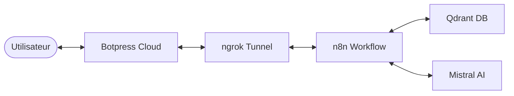

# 🇲🇦 Wathiqa (وثيقة) — Chatbot des Démarches Administratives Marocaines

> **L'assistant intelligent pour simplifier vos procédures administratives au Maroc.**

[](https://www.python.org/)
[](https://n8n.io/)
[](https://qdrant.tech/)
[](https://mistral.ai/)
[](https://botpress.com/)

**Wathiqa** est un chatbot bilingue (Français / Darija) conçu pour centraliser et expliquer **57 démarches administratives marocaines**. Il utilise une architecture RAG (Retrieval-Augmented Generation) pour fournir des réponses précises basées sur une base de connaissances vérifiée.

---

## 🏗️ Architecture du Système



### Stack Technique
- **Frontend** : Botpress Cloud (Interface bilingue)
- **Backend** : n8n (Orchestration RAG)
- **Intelligence** : Mistral AI (Embeddings & Génération)
- **Base Vectorielle** : Qdrant (Stockage des 57 documents)
- **Tunneling** : ngrok (Communication Cloud/Local)

---

## 🚀 Installation Étape par Étape

### 1. Préparation de la Base Vectorielle (Qdrant)
Lancez Qdrant via Docker :
```bash
docker run -p 6333:6333 qdrant/qdrant
```

### 2. Indexation des Documents
Configurez votre clé Mistral et lancez le chargement :
```bash
pip install requests
# Modifiez load.py avec votre MISTRAL_KEY
python load.py
```

### 3. Orchestration (n8n)
1. Importez `Wathiqa.json` dans votre instance n8n.
2. Configurez les credentials pour **Mistral AI** et **Qdrant**.
3. Activez le webhook.

### 4. Interface (Botpress)
1. Importez `Wathiqa.bpz` dans Botpress Studio.
2. Mettez à jour l'URL du webhook dans le nœud d'exécution de code avec votre URL **ngrok**.
3. Publiez le bot.

---

## 🔄 CI/CD avec Jenkins
Le projet inclut un `Jenkinsfile` qui automatise :
- La vérification de la syntaxe Python.
- Le diagnostic et l'auto-réparation (Self-Healing) des services Qdrant et n8n.
- Le déploiement du pipeline d'indexation.

---

## 🌍 Fonctionnalités Bilingues
Chaque réponse de Wathiqa est structurée en deux parties :
1. **Français** : Détails techniques, prix, délais et lieux.
2. **🇲🇦 الدارجة** : Un résumé simple et accessible en darija marocaine.

---
Created by **Samah AZIZ** & **Keltoum AGAZZARA**
Projet IA - Avril 2026
