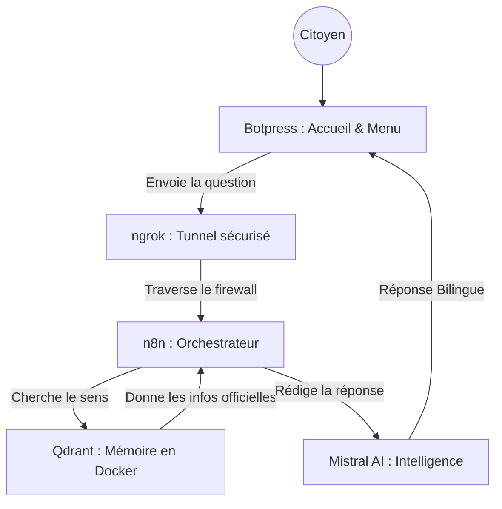

# 🇲🇦 Wathiqa (وثيقة) — Le Guide Technique Ultime (Masterclass RAG)

> **"L'accès à l'information administrative est un droit, Wathiqa en fait une conversation."**

Wathiqa est un écosystème conçu pour centraliser et simplifier **57 démarches administratives marocaines**. Avant de passer à l'installation, il est essentiel de comprendre le rôle de chaque technologie utilisée.

---

## 🧠 1. Comprendre l'Architecture : Pourquoi ces outils ?

Pour que Wathiqa puisse répondre à un citoyen, 5 acteurs travaillent ensemble. Voici pourquoi nous les avons choisis :

### 1.1 Docker (L'Infrastructure de Conteneurisation)
*   **Son Utilité** : Imaginez Docker comme un "conteneur" qui contient tout ce dont une application a besoin pour fonctionner.
*   **Pourquoi l'utiliser ?** : Sans Docker, vous devriez installer Qdrant manuellement, configurer ses bases de données et ses ports, ce qui est complexe et risqué. Docker nous permet de lancer Qdrant en une seule commande, avec la garantie qu'il fonctionnera exactement de la même manière sur n'importe quel ordinateur.

### 1.2 Qdrant (La Mémoire Sémantique)
*   **Son Utilité** : C'est notre base de données spécialisée. Contrairement à une base classique, elle stocke le "sens" des documents (des vecteurs).
*   **Pourquoi l'utiliser ?** : Elle permet de retrouver instantanément les 57 procédures administratives même si l'utilisateur utilise des synonymes ou des termes proches.

### 1.3 Mistral AI (Le Cerveau Intelligent)
*   **Son Utilité** : C'est l'intelligence qui lit les documents trouvés et rédige la réponse.
*   **Pourquoi l'utiliser ?** : C'est l'un des meilleurs modèles au monde pour comprendre le Français tout en étant capable de générer du contenu en Darija marocaine.

### 1.4 n8n (Le Chef d'Orchestre)
*   **Son Utilité** : Il relie tous les autres outils entre eux. Il reçoit la question, interroge Qdrant, et demande à Mistral de répondre.
*   **Pourquoi l'utiliser ?** : Il permet de créer une logique complexe visuellement, ce qui facilite les tests et la maintenance du projet sans écrire de code superflu.

### 1.5 ngrok (Le Pont de Communication Cloud-Local)
*   **Son Utilité** : Il crée un tunnel sécurisé entre votre ordinateur local et internet.
*   **Pourquoi l'utiliser ?** : Botpress est dans le Cloud (internet). Votre base de données et n8n sont sur votre PC (local). Sans ngrok, Botpress ne pourrait jamais atteindre votre PC pour lui poser des questions.

---

## 🏗️ Schéma du flux de données


---

## 🚀 2. Guide d'Installation Ultra-Détaillé (Pas à Pas)

### 📋 Phase 0 : Préparation des Comptes
Créez ces 3 comptes gratuits (obligatoire) :
1. **Mistral AI** : Récupérez votre **API KEY** sur [console.mistral.ai](https://console.mistral.ai/).
2. **ngrok** : Récupérez votre **Authtoken** sur [ngrok.com](https://ngrok.com/).
3. **Botpress** : Créez un compte sur [app.botpress.cloud](https://app.botpress.cloud/).

---

### Etape 1 : Préparer l'environnement avec Docker
1. **Téléchargement** : Installez [Docker Desktop](https://www.docker.com/products/docker-desktop/).
2. **Lancer Qdrant** : Une fois Docker ouvert, tapez cette commande dans votre terminal :
   ```bash
   docker run -d -p 6333:6333 -v qdrant_storage:/qdrant/storage qdrant/qdrant
   ```
   *Explication : Cette commande dit à Docker d'aller chercher Qdrant et de le faire tourner "en arrière-plan" (-d) sur le port 6333.*
3. **✅ Vérification** : Allez sur `http://localhost:6333/dashboard`. Si la page s'affiche, Docker fait bien tourner votre base de données.

---

### Etape 2 : Préparer les données (Python)
1. **Terminal** : Ouvrez un dossier dans `Projet_IA`.
2. **Environnement virtuel** :
   - *Windows* : `python -m venv venv` puis `.\venv\Scripts\activate`
   - *Mac/Linux* : `python3 -m venv venv` puis `source venv/bin/activate`
3. **Installation** : `pip install -r requirements.txt`
4. **Clé API** :
   - *Windows* : `set MISTRAL_KEY=votre_cle_ici`
   - *Mac/Linux* : `export MISTRAL_KEY=votre_cle_ici`
5. **Action** : `python load.py`. Cela va envoyer les 57 documents vers Qdrant.

---

### Etape 3 : Ouvrir le tunnel avec ngrok
1. Dans un terminal vide : `ngrok http 5678`
2. **✅ Vérification** : Copiez l'URL HTTPS (ex: `https://abcd-123.ngrok-free.app`). Sans cette URL, le bot ne fonctionnera pas.

---

### Etape 4 : Configurer n8n
1. Lancez n8n : `npx n8n`. Allez sur `http://localhost:5678`.
2. **Import** : Menu **Workflows** > **Add Workflow** > **Import from File...** > Choisissez `Wathiqa.json`.
3. **Configuration** : Dans le nœud **Mistral AI**, collez votre API KEY générée en Phase 0.
4. **✅ Action** : Cliquez sur **Execute Workflow**.

---

### Etape 5 : Activer l'Interface Botpress
1. Sur [Botpress Cloud](https://app.botpress.cloud/), créez un Bot.
2. **Import** : Logo Botpress (haut gauche) > **Import/Export** > **Import** > Choisissez `Wathiqa.bpz`.
3. **Lien Webhook** : Dans le nœud de code, remplacez l'URL par `VOTRE_URL_NGROK/webhook/wathiqa`.
4. Cliquez sur **Publish**.

---

## 👥 Équipe Projet
- **Samah AZIZ** (Architecture & Logique RAG)
- **Keltoum AGAZZARA** (Stratégie Documentaire & UI Design)

**Licence Ingénierie Informatique (LST 2I) — FST Mohammedia**
**Université Hassan II de Casablanca — 2026**
