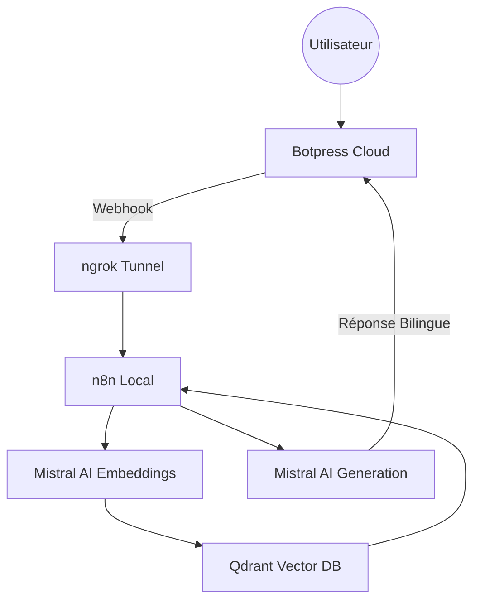

# 🇲🇦 Wathiqa (وثيقة) — Le Guide Technique Ultime (Masterclass RAG)

> **"L'accès à l'information administrative est un droit, Wathiqa en fait une conversation."**

Wathiqa est un écosystème conçu pour centraliser et simplifier **57 démarches administratives marocaines**. Ce projet utilise une architecture de **Retrieval-Augmented Generation (RAG)** bilingue, orchestrée localement.

---

## 🏗️ 1. Architecture du Système

Le projet repose sur 5 briques technologiques qui communiquent en temps réel :



---

## 🚀 2. Guide d'Installation Ultra-Détaillé (Étape par Étape)

Ce guide est conçu pour vous permettre de configurer l'écosystème complet même si vous n'êtes pas un expert.

### 📋 Phase 0 : Préparation des Comptes
Avant d'ouvrir votre terminal, créez les comptes gratuits suivants :
1. **Mistral AI** : Créez un compte sur [console.mistral.ai](https://console.mistral.ai/) et générez une **API KEY**.
2. **ngrok** : Créez un compte sur [ngrok.com](https://ngrok.com/) pour obtenir votre **Authtoken**.
3. **Botpress** : Créez un compte sur [app.botpress.cloud](https://app.botpress.cloud/).

---

### Etape 1 : Lancement de la Base de Données (Qdrant)
Qdrant est le "cerveau" qui stocke les 57 documents administratifs sous forme de vecteurs.
1. Installez [Docker Desktop](https://www.docker.com/products/docker-desktop/) et lancez-le.
2. Ouvrez un terminal (CMD ou PowerShell sur Windows) et tapez :
   ```bash
   docker run -d -p 6333:6333 -v qdrant_storage:/qdrant/storage qdrant/qdrant
   ```
3. **✅ Vérification** : Ouvrez votre navigateur sur `http://localhost:6333/dashboard`. Si vous voyez l'interface bleue de Qdrant, c'est gagné !

---

### Etape 2 : Indexation des Documents (Python)
Nous allons transformer les fichiers texte bruts en "intelligence" dans Qdrant.
1. **Ouvrez votre terminal** dans le dossier du projet `Projet_IA`.
2. **Créez l'environnement virtuel** :
   - *Windows* : `python -m venv venv` puis `.\venv\Scripts\activate`
   - *Mac/Linux* : `python3 -m venv venv` puis `source venv/bin/activate`
3. **Installez les bibliothèques** :
   ```bash
   pip install -r requirements.txt
   ```
4. **Configurez votre clé Mistral** :
   - *Windows* : `set MISTRAL_KEY=votre_cle_ici`
   - *Mac/Linux* : `export MISTRAL_KEY=votre_cle_ici`
5. **Lancez l'indexation** :
   ```bash
   python load.py
   ```
   **✅ Vérification** : Le script doit afficher "100% terminé" ou lister les documents un par un. Retournez sur le dashboard Qdrant (`http://localhost:6333/dashboard`) : une collection `AdminBot` doit être apparue !

---

### Etape 3 : Création du Tunnel Web (ngrok)
Botpress Cloud doit "appeler" votre ordinateur. ngrok crée ce pont.
1. Dans un **nouveau** terminal, tapez :
   ```bash
   ngrok http 5678
   ```
2. **✅ Vérification** : Une URL s'affiche (ex: `https://abcd-123.ngrok-free.app`). **Copiez-la précieusement**, vous en aurez besoin pour l'étape 5.

---

### Etape 4 : Configuration de l'Orchestrateur (n8n)
n8n fait le lien entre Mistral, Qdrant et Botpress.
1. Lancez n8n dans un terminal : `npx n8n`.
2. Allez sur `http://localhost:5678`.
3. **Importation** : Cliquez sur **Workflows** (à gauche) > **Add Workflow** > **Import from File...** et sélectionnez `Wathiqa.json`.
4. **Configuration des Nœuds** :
   - Double-cliquez sur le nœud **Mistral AI** et collez votre clé API.
   - Double-cliquez sur le nœud **Qdrant** et assurez-vous que l'URL est `http://localhost:6333`.
5. **✅ Activation** : Cliquez sur le bouton **Execute Workflow** en haut. Il doit être en état d'attente ("Waiting for Webhook").

---

### Etape 5 : Front-end (Botpress Cloud)
C'est ici que l'utilisateur discutera avec Wathiqa.
1. Sur [Botpress Cloud](https://app.botpress.cloud/), créez un nouveau Bot.
2. Cliquez sur **Edit with Studio**.
3. **Importation** : Cliquez sur le logo Botpress (haut à gauche) > **Import/Export** > **Import** et sélectionnez `Wathiqa.bpz`.
4. **Lien Webhook** : Cherchez le nœud qui contient du code ("Execute Code") et remplacez l'URL cible par `VOTRE_URL_NGROK/webhook/wathiqa`.
5. Cliquez sur **Publish** en haut à droite.

---

## 🇲🇦 3. Fonctionnalités & Logique Bilingue
Wathiqa ne se contente pas de répondre. Il adapte son langage :
1. **Français** : Pour la rigueur des procédures (documents, prix, lieux).
2. **Darija** : Pour un "Résumé 🇲🇦" sous chaque réponse, permettant à tout citoyen de comprendre l'essentiel en un clin d'œil.

---

## ⚠️ 4. Dépannage (En cas de problème)
- **Erreur 404 dans Botpress** : Votre URL ngrok a expiré ou changé. Mettez-la à jour dans Botpress.
- **Qdrant vide** : Relancez le script `load.py` en vérifiant que votre clé Mistral est bien configurée.
- **n8n ne reçoit rien** : Vérifiez que vous avez bien ajouté `/webhook/wathiqa` à la fin de votre URL ngrok dans Botpress.

---

## 👥 Équipe Projet
- **Samah AZIZ** (Architecture & Logique RAG)
- **Keltoum AGAZZARA** (Stratégie Documentaire & UI Design)

**Licence Ingénierie Informatique (LST 2I) — FST Mohammedia**
**Université Hassan II de Casablanca — 2026**
