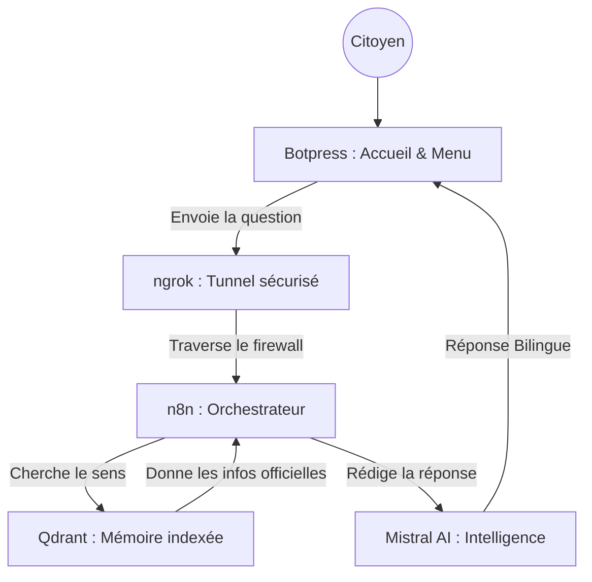

# 🇲🇦 Wathiqa (وثيقة) — Le Guide Technique Ultime (Masterclass RAG)

> **"L'accès à l'information administrative est un droit, Wathiqa en fait une conversation."**

Wathiqa est un écosystème conçu pour centraliser et simplifier **57 démarches administratives marocaines**. Avant de passer à l'installation, il est essentiel de comprendre "qui fait quoi" dans cette architecture.

---

## 🧠 1. Comprendre l'Architecture : Qui fait quoi ?

Pour que Wathiqa puisse répondre à un citoyen, 5 acteurs travaillent ensemble dans l'ombre :

### 1.1. Botpress Cloud (L'Assistant de Première Ligne)
*   **Son Utilité** : C'est le visage du projet. Il accueille l'utilisateur, lui propose les 10 catégories de démarches (CNIE, Mariage, Passeport...) et capture sa question.
*   **Pourquoi lui ?** : Il offre une interface mobile-friendly et gère intelligemment les menus bilingues.

### 1.2. ngrok (Le Pont Invisible)
*   **Son Utilité** : C'est la brique la plus "critique". Comme votre projet tourne sur votre ordinateur personnel (local) et que Botpress est sur internet (cloud), ngrok crée un tunnel sécurisé pour que Botpress puisse envoyer la question à votre machine.
*   **Sans lui** : Botpress parlerait dans le vide et ne pourrait jamais atteindre votre "cerveau" n8n.

### 1.3. n8n (Le Chef d'Orchestre)
*   **Son Utilité** : C'est le centre de commande. Quand il reçoit une question via ngrok, il déclenche une suite d'actions : il interroge la mémoire (Qdrant), demande à l'IA (Mistral) de réfléchir, puis renvoie la réponse finale.
*   **Pourquoi lui ?** : Il permet de visualiser tout le flux de données sans écrire des milliers de lignes de code complexe.

### 1.4. Qdrant (La Mémoire sémantique)
*   **Son Utilité** : C'est là que sont stockés nos 57 documents officiels. Mais attention, il ne les stocke pas comme de simples fichiers texte. Il stocke leur **"sens"** sous forme de coordonnées mathématiques (vecteurs).
*   **Résultat** : Si vous demandez "Comment faire ma carte ?", il comprend que vous parlez de la "CNIE" même si vous n'avez pas utilisé le mot exact.

### 1.5. Mistral AI (Le Cerveau Intelligent)
*   **Son Utilité** : C'est l'expert qui lit les documents trouvés par Qdrant et rédige une réponse claire. C'est lui qui possède le "talent" de parler à la fois Français et Darija.
*   **Son rôle double** : Il transforme d'abord les phrases en nombres (Embeddings) et finit par rédiger le texte final (Génération).

---

## 🏗️ Schéma du flux de données


---

## 🚀 2. Guide d'Installation Ultra-Détaillé (Pas à Pas)

Une fois que vous avez compris le rôle de chaque brique, voici comment les assembler sur votre machine.

### 📋 Phase 0 : Préparation des Comptes
Créez ces 3 comptes gratuits (obligatoire) :
1. **Mistral AI** : Récupérez votre **API KEY** sur [console.mistral.ai](https://console.mistral.ai/).
2. **ngrok** : Récupérez votre **Authtoken** sur [ngrok.com](https://ngrok.com/).
3. **Botpress** : Créez un compte sur [app.botpress.cloud](https://app.botpress.cloud/).

---

### Etape 1 : Lancer la Mémoire (Qdrant)
1. Installez [Docker Desktop](https://www.docker.com/products/docker-desktop/).
2. Tapez cette commande dans votre terminal :
   ```bash
   docker run -d -p 6333:6333 -v qdrant_storage:/qdrant/storage qdrant/qdrant
   ```
3. **✅ Vérification** : Allez sur `http://localhost:6333/dashboard`. Si la page s'affiche, Qdrant est prêt.

---

### Etape 2 : Indexer les 57 Documents (Python)
1. **Terminal** : Placez-vous dans le dossier `Projet_IA`.
2. **Environnement** : 
   - *Windows* : `python -m venv venv` ; `.\venv\Scripts\activate`
   - *Mac/Linux* : `python3 -m venv venv` ; `source venv/bin/activate`
3. **Installation & Clé** :
   ```bash
   pip install -r requirements.txt
   set MISTRAL_KEY=votre_cle_ici  # Windows
   export MISTRAL_KEY=votre_cle_ici  # Mac/Linux
   ```
4. **Action** : `python load.py`. 
   **✅ Vérification** : Le terminal confirme que les documents sont dans la collection `AdminBot`.

---

### Etape 3 : Ouvrir le Pont (ngrok)
1. Dans un terminal vide :
   ```bash
   ngrok http 5678
   ```
2. **✅ Vérification** : Copiez l'URL HTTPS générée (ex: `https://abcd-123.ngrok-free.app`).

---

### Etape 4 : Configurer le Chef d'Orchestre (n8n)
1. Lancez n8n : `npx n8n`. Allez sur `http://localhost:5678`.
2. **Import** : Menu **Workflows** > **Add Workflow** > **Import from File...** > Choisissez `Wathiqa.json`.
3. **Credentials** : Dans le nœud **Mistral AI**, collez votre API KEY.
4. **✅ Action** : Cliquez sur **Execute Workflow**.

---

### Etape 5 : Activer l'Interface (Botpress)
1. Sur [Botpress Cloud](https://app.botpress.cloud/), créez un Bot.
2. **Import** : Logo Botpress (haut gauche) > **Import/Export** > **Import** > Choisissez `Wathiqa.bpz`.
3. **Lien Webhook** : Dans le nœud de code, remplacez l'URL par `URL_NGROK/webhook/wathiqa`.
4. Cliquez sur **Publish**.

---

## 👥 Équipe Projet
- **Samah AZIZ** (Architecture & Logique RAG)
- **Keltoum AGAZZARA** (Stratégie Documentaire & UI Design)

**Licence Ingénierie Informatique (LST 2I) — FST Mohammedia**
**Université Hassan II de Casablanca — 2026**
