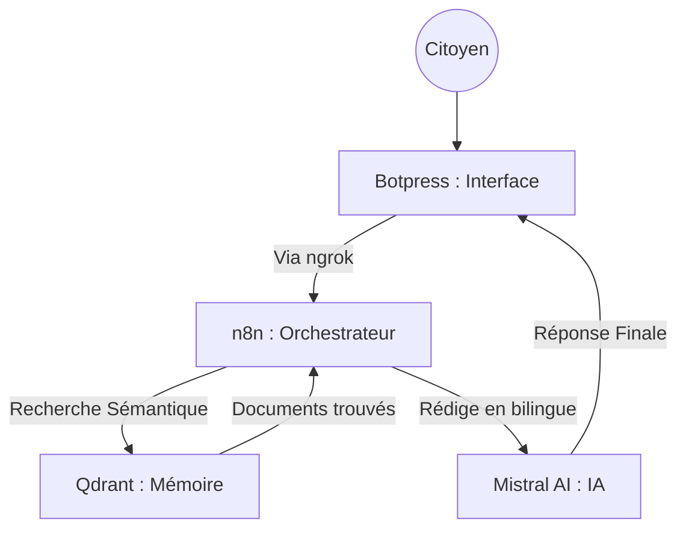

# 🇲🇦 Wathiqa (وثيقة) — Le Guide Technique Ultime (Masterclass RAG)

> **"L'accès à l'information administrative est un droit, Wathiqa en fait une conversation."**

Wathiqa est un écosystème conçu pour centraliser et simplifier **57 démarches administratives marocaines**. Ce guide technique explique le fonctionnement, l'utilité des outils et fournit le code source pour reproduire le projet.

---

## 🧠 1. Comprendre l'Architecture : Pourquoi ces outils ?

### 1.1 Docker (L'Infrastructure)
*   **Utilité** : Docker crée un "conteneur" isolé.
*   **Pourquoi ?** : Il permet de lancer la base de données Qdrant sans installation complexe. C'est la garantie que le projet fonctionnera sur PC, Mac ou Linux de la même manière.

### 1.2 Qdrant (La Mémoire Sémantique)
*   **Utilité** : Stocke les documents sous forme de vecteurs (nombres représentant le sens).
*   **Pourquoi ?** : Permet de trouver la réponse même si l'utilisateur ne tape pas les mots exacts.

### 1.3 Mistral AI (Le Cerveau Intelligent)
*   **Utilité** : Transforme le texte en vecteurs et rédige les réponses finales.
*   **Pourquoi ?** : Modèle souverain ultra-performant pour le Français et le Darija.

### 1.4 n8n (Le Chef d'Orchestre)
*   **Utilité** : Relie Botpress, Qdrant et Mistral sans coder un serveur de zéro.
*   **Pourquoi ?** : Sa manipulation visuelle facilite la gestion du pipeline RAG.

### 1.5 ngrok (Le Pont Cloud-Local)
*   **Utilité** : Crée un tunnel sécurisé entre Botpress (Cloud) et votre PC (Local).
*   **Pourquoi ?** : Sans lui, les messages envoyés par les citoyens resteraient bloqués sur internet.

---

## 🏗️ Flux de données


---

## 🚀 2. Guide d'Installation Masterclass (Pas à Pas)

### 📋 Phase 0 : Préparation des Comptes
Créez ces 3 comptes gratuits :
1. **Mistral AI** : Récupérez votre **API KEY** sur [console.mistral.ai](https://console.mistral.ai/).
2. **ngrok** : Récupérez votre **Authtoken** sur [ngrok.com](https://ngrok.com/).
3. **Botpress** : Créez un compte sur [app.botpress.cloud](https://app.botpress.cloud/).

---

### Etape 1 : Infrastructure (Docker)
1. Installez [Docker Desktop](https://www.docker.com/products/docker-desktop/).
2. Lancez Qdrant via le terminal :
   ```bash
   docker run -d -p 6333:6333 -v qdrant_storage:/qdrant/storage qdrant/qdrant
   ```
3. **✅ Vérification** : Allez sur `http://localhost:6333/dashboard`.

---

### Etape 2 : Données & Indexation (Python)
1. **Terminal** : Placez-vous dans `Projet_IA`.
2. **Environnement** : 
   - *Windows* : `python -m venv venv` ; `.\venv\Scripts\activate`
   - *Mac/Linux* : `python3 -m venv venv` ; `source venv/bin/activate`
3. **Action** :
   ```bash
   pip install -r requirements.txt
   set MISTRAL_KEY=votre_cle_api  # Windows
   export MISTRAL_KEY=votre_cle_api  # Mac/Linux
   python load.py
   ```

---

### Etape 3 : Tunneling (ngrok)
1. Dans un terminal vide : `ngrok http 5678`.
2. **✅ Vérification** : Copiez l'URL HTTPS (ex: `https://abcd.ngrok-free.app`).

---

### Etape 4 : Orchestration (n8n)
1. Lancez n8n : `npx n8n`. Allez sur `http://localhost:5678`.
2. **Import** : Menu **Workflows** > **Add Workflow** > **Import from File...** > Choisissez `Wathiqa.json`.
3. **Credentials** : Dans le nœud **Mistral AI**, collez votre API KEY.
4. **✅ Action** : Cliquez sur **Execute Workflow**.

---

### Etape 5 : Interface (Botpress Studio)
1. Sur [Botpress Cloud](https://app.botpress.cloud/), créez un Bot.
2. **Import** : Logo (haut gauche) > **Import/Export** > **Import** > Choisissez `Wathiqa.bpz`.
3. **Lien Webhook** : Dans le nœud de code, remplacez l'URL par `VOTRE_URL_NGROK/webhook/wathiqa`.
4. Cliquez sur **Publish**.

---

## 💻 3. Les Coulisses : Le Code du Projet

Voici les fragments de code essentiels qui font tourner Wathiqa.

### 3.1 Script d'Indexation (`load.py`)
Ce script Python parcourt les 57 documents, génère les embeddings via Mistral et les injecte dans Qdrant.

```python
import requests
import os

MISTRAL_KEY = os.getenv("MISTRAL_KEY")
QDRANT_URL = "http://localhost:6333"

# Chargement et indexation
for filename in os.listdir("documents"):
    if filename.endswith(".txt"):
        with open(f"documents/{filename}", 'r', encoding='utf-8') as f:
            content = f.read()
            
            # 1. Génération de l'embedding
            resp = requests.post(
                "https://api.mistral.ai/v1/embeddings",
                headers={"Authorization": f"Bearer {MISTRAL_KEY}"},
                json={"model": "mistral-embed", "input": [content]}
            )
            vector = resp.json()["data"][0]["embedding"]
            
            # 2. Injection dans Qdrant
            requests.put(
                f"{QDRANT_URL}/collections/AdminBot/points",
                json={"points": [{"id": i, "vector": vector, "payload": {"content": content}}]}
            )
```

### 3.2 Script de Communication (Botpress)
Ce code JavaScript est exécuté par Botpress pour envoyer la question de l'utilisateur à notre serveur local n8n.

```javascript
const question = workflow.userQuestion || event.preview

try {
  const response = await axios.post(
    'https://VOTRE_URL_NGROK/webhook/wathiqa',
    { question: question },
    {
      headers: { 'ngrok-skip-browser-warning': 'true' },
      timeout: 30000
    }
  )
  workflow.answer = response.data.answer
} catch (err) {
  workflow.answer = "⚠️ Service momentanément indisponible."
}
```

---

## ⚠️ 4. Difficultés Rencontrées & Solutions
- **Lien ngrok instable** : L'URL change à chaque redémarrage.
  - *Solution* : Utilisation d'un domaine fixe gratuit proposé par ngrok.
- **Délai de réponse** : Mistral peut être long à répondre.
  - *Solution* : Augmentation du timeout à 30 secondes pour éviter les coupures.
- **Hallucinations** : L'IA inventait des prix pour les procédures.
  - *Solution* : Verrouillage du prompt pour forcer l'usage du contexte uniquement.

---

## 👥 Équipe Projet
- **Samah AZIZ** (Architecture & Logique RAG)
- **Keltoum AGAZZARA** (Stratégie Documentaire & UI Design)

**Licence Ingénierie Informatique (LST 2I) — FST Mohammedia**
**Université Hassan II de Casablanca — 2026**
