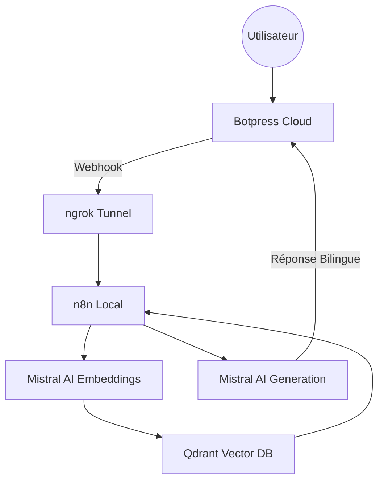

# 🇲🇦 Wathiqa (وثيقة) — Le Guide Technique Ultime (Masterclass RAG)

> **"L'accès à l'information administrative est un droit, Wathiqa en fait une conversation."**

Wathiqa est un écosystème conçu pour centraliser et simplifier **57 démarches administratives marocaines**. Ce projet n'est pas une simple interface de chat, mais une architecture complexe de **Retrieval-Augmented Generation (RAG)** bilingue, orchestrée localement pour garantir souveraineté et flexibilité.

---

## 🏛️ 1. La Mission : Résoudre la Complexité Administrative
Au Maroc, trouver des informations fiables sur une CNIE, un passeport ou un permis de construire nécessite souvent de naviguer sur de multiples sites web ou de se déplacer. **Wathiqa** résout ce problème en offrant :
- **Centralisation** : 10 domaines administratifs couverts.
- **Accessibilité** : Réponses en Français et résumé en **Darija** marocaine.
- **Précision** : Informations basées sur une base de données vectorielle vérifiée.

---

## 🏗️ 2. Architecture Technique : Les 5 Piliers
Le projet repose sur 5 briques technologiques qui communiquent en temps réel :



### 2.1. Botpress Cloud (L'Interface conversationnelle)
Le "Front-end" du projet. Il gère le flux de conversation (menus, catégories) et l'IA native qui redirige l'utilisateur.
- **Rôle** : Capturer la question et l'envoyer au backend via un webhook.
- **Scripting** : Utilise des nœuds "Execute Code" en JavaScript pour communiquer avec n8n.

### 2.2. n8n (L'Orchestrateur Vital)
C'est le "Spine" (colonne vertébrale) du système. Au lieu de coder un serveur complexe, nous avons choisi n8n pour sa visibilité et sa flexibilité.
- **Workflow** : Un pipeline de 8 nœuds gérant l'extraction de la question, la vectorisation, la recherche sémantique et la génération de réponse.

### 2.3. ngrok (Le Pont de Communication)
Indispensable pour lier le Cloud au Local.
- **Pourquoi ?** : Botpress Cloud ne peut pas accéder à une adresse `localhost`. ngrok crée un tunnel public HTTPS sécurisé vers votre port local `5678`.

### 2.4. Qdrant (La Mémoire Sémantique)
Base de données vectorielle ultra-rapide.
- **Concept** : Elle stocke les documents sous forme de vecteurs mathématiques, permettant une recherche par *sens* plutôt que par mots-clés simples.

### 2.5. Mistral AI (Le Cortex Intelligent)
- **mistral-embed** : Transforme les textes en vecteurs.
- **mistral-small-latest** : Génère la réponse finale en respectant les consignes bilingues.

---

## 🚀 3. Guide d'Installation Masterclass (Pas à Pas)

### Étape 1 : Infrastructure Docker (Qdrant)
1. Téléchargez et lancez [Docker Desktop](https://www.docker.com/products/docker-desktop/).
2. Lancez le serveur Qdrant dans un terminal :
   ```bash
   docker run -d -p 6333:6333 -v qdrant_storage:/qdrant/storage qdrant/qdrant
   ```
3. **Vérification** : Ouvrez `http://localhost:6333/dashboard` dans votre navigateur. Vous devez voir l'interface Qdrant.

### Étape 2 : Préparation du Pipeline Python (RAG)
1. **Environnement** : Ouvrez un terminal dans le dossier du projet.
   ```bash
   python -m venv venv
   source venv/bin/activate  # Windows: venv\Scripts\activate
   ```
2.  **Dépendances** :
    ```bash
    pip install -r requirements.txt
    ```
3.  **Clé API** : Récupérez votre clé sur [Mistral Console](https://console.mistral.ai).
    ```bash
    # Windows
    set MISTRAL_KEY=votre_cle_ici
    # Mac/Linux
    export MISTRAL_KEY=votre_cle_ici
    ```
4.  **Indexation** : Lancez le script pour injecter les 57 documents dans Qdrant.
    ```bash
    python load.py
    ```

### Étape 3 : Tunneling avec ngrok
1. Créez un compte sur [ngrok.com](https://ngrok.com/).
2. Installez ngrok et lancez le tunnel :
   ```bash
   ngrok http 5678
   ```
3. **Important** : Copiez l'URL `https://xxxx.ngrok-free.app` qui s'affiche. C'est l'adresse publique de votre projet.

### Étape 4 : Orchestration n8n
1. Lancez n8n : `npx n8n` (ou via Docker).
2. Ouvrez l'interface (`http://localhost:5678`).
3. Cliquez sur **Workflows** > **Import from File...** et choisissez `Wathiqa.json`.
4. Dans le nœud **Mistral AI**, collez votre clé API.
5. Dans le nœud **Qdrant**, vérifiez que l'URL est bien `http://localhost:6333`.
6. Cliquez sur **Execute Workflow** (le cercle doit devenir vert/actif).

### Étape 5 : Front-end Botpress Cloud
1. Créez un bot sur [Botpress Cloud](https://app.botpress.cloud).
2. Dans le **Studio**, cliquez sur l'icône en haut à gauche (Logo Botpress) > **Import/Export** > **Import**.
3. Choisissez le fichier `Wathiqa.bpz`.
4. Trouvez le nœud nommé "Execution de code" ou "R├®ponse" et remplacez l'URL cible par votre URL ngrok + `/webhook/wathiqa`.
5. Cliquez sur **Publish** en haut à droite.

---

## 🇲🇦 4. Fonctionnalités & Logique Bilingue
Wathiqa utilise un **System Prompt** avancé dans Mistral AI pour garantir une accessibilité maximale :
1. **Le Français** : Pour la précision administrative et formelle.
2. **Le Darija** : Pour un résumé simplifié et chaleureux, facilitant la compréhension immédiate.

---

## ⚠️ 5. Difficultés Rencontrées & Solutions
- **ngrok Warning** : Botpress bloquait parfois sur la page d'avertissement de ngrok.
  - *Solution* : Ajout du header `ngrok-skip-browser-warning: true` dans la requête axios.
- **Timeouts** : L'API Mistral peut être lente.
  - *Solution* : Augmentation du timeout à 30 secondes dans n8n et Botpress.
- **Hallucinations** : Le modèle inventait des prix pour les timbres.
  - *Solution* : "Finetuning" du prompt pour forcer Mistral à dire "Information non disponible" si elle n'est pas dans le document.

---

## 👥 Équipe Projet
- **Samah AZIZ** (Architecture Système & Logique RAG)
- **Keltoum AGAZZARA** (Stratégie Documentaire & UI Design)

**Licence Ingénierie Informatique (LST 2I) — 2026**
**FST Mohammedia - Université Hassan II**
